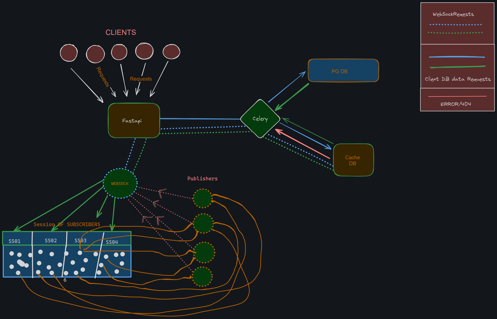

# ROOM 

ROOM is built with FASTAPI, Celery, Redis, and PostgreSQL. It is designed to for fast and secure chat application made with room session message concept.




## Table of Contents

- [ROOM](#room)
  - [Table of Contents](#table-of-contents)
  - [Features](#features)
  - [Getting Started](#getting-started)
  - [](#)
  - [TODO](#todo)

## Features

- E2E Encryption based on signal protocol using Diffie Hellman Key Exchange and Elliptic Curve Key generation 
- Auth0 Server Login and  JWT session authentication 
- You can Create your own Interface for ROOM web client or desktop Client
- Implement client side feature like cache and session cache according to your use
- PUB/SUB based Web Socket which allows seamless message transfer
- Decaying messages and decaying chat sessions 
- Create multiple chat sessions in same Chat Room with different set of members in each
- Response Serialization using Proto Buffer making response transfer speed super fast

<!-- ## Prerequisites

Before you begin, ensure you have met the following requirements:

- [List the prerequisites and dependencies needed to run your project]
- [E.g., Python 3.x, Docker, etc.] -->

## Getting Started

Follow these steps to get your project up and running:

1. Clone the repository:

   ```bash
   git clone https://github.com/yourusername/room.git
   ```
2. Install project dependencies:

    ```bash
    Copy code
    pip install -r requirements.txt
    ```
    [Any additional setup steps if required]

3. Run the project:
  
    ```bash
    Copy code
    uvicorn main:app --host 0.0.0.0 --port 8000 --reload
    ```
    Open your web browser and navigate to http://localhost:8000 to access the application.

4. Configuration
    [Explain how to configure your project, including environment variables and configuration files]

5. Deployment
    Using Docker
    Build the Docker image:
  
    ```bash
    Copy code
    docker build -t room-app .
    ```
    Run the Docker container:
  
    ```bash
    Copy code
    docker run -d -p 8000:8000 room-app
    ```
  

-API Documentation
  [Provide information on how to access the API documentation, e.g., Swagger or ReDoc]

  API documentation is available at http://localhost:8000/docs.
  
  Contributing
  [Explain how others can contribute to your project, including guidelines and code of conduct]

License
This project is licensed under the [License Name] License - see the LICENSE.md file for details.

##
## TODO
- Implement auth0 authentication for login to server
- Implement Proto Buffer
<!-- - Complete PUB/SUB Redis backend Websocket and Test to check it working -->
- Test DB
- Write alembic Migration
- Write a logger for every fastapi server user which uses redis to store logs using proto buffer log serialized in string and stored in redis using user and decrypted using signal protocol since all the server db both should be accessible from client in an E2E Encryption
- Add Events for certain tasks like creation of user or creation of room 
- Add things to server start startup event
- Create Tasks for celery
  - ClientInit() func
  - Get User Session and Message in a Room
  - Get All User Sessions 
  - Get all Messages by a user
  - Get All session for user
  - Send File (maybe create a separate service in go for file transfer)
  - Get User Log
  - Create User
  - Create Room
  - 
- Make Operations Async
- Create a better Config for fastapi integrated with Docker Container and without it (if possible)
- Add details to schemas.py and dbModel.py