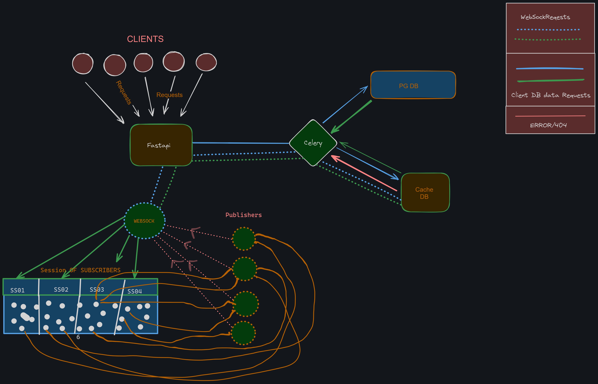

# ROOM 

ROOM is built with FASTAPI, Celery, Redis, and PostgreSQL. It is designed to for fast and secure chat application made with room session message concept.




## Table of Contents

- [ROOM](#room)
  - [Table of Contents](#table-of-contents)
  - [Features](#features)
  - [DB MODEL](#db-model)
  - [Getting Started](#getting-started)
  - [](#)
  - [TODO](#todo)

## Features

- E2E Encryption based on signal protocol using Diffie Hellman Key Exchange and Elliptic Curve Key generation 
- Auth0 Server Login and  JWT session authentication 
- You can Create your own Interface for ROOM web client or desktop Client
- Implement client side feature like cache and session cache according to your use
- PUB/SUB based Web Socket which allows seamless message transfer
- Decaying messages and decaying chat sessions 
- Create multiple chat sessions in same Chat Room with different set of members in each
- Response Serialization using Proto Buffer making response transfer speed super fast

## DB MODEL

- ABSTRACT CLASS TIME
	this class is inherited by all the other class contains 2 fields - created time , last update time
- USER  CLASS
	- user_id : int
	- phone_no : 10 digit int
	- email : string
	- rooms : Set(user_ids) : list of user ids who are part of the Room
	- active_session : Set(session_id) : set of active sessions user is in
	- 
- ROOM CLASS (Room is group of sessions where users of room can create session to talk with other users  )
	- room_id : room id int
	- sessions : Set(session_id) : set of session ids that are part of room
	- room_size : int : No of maximum rooms that can be created
	- creator_id : int : user_id of the user who created the room
	- 
- SESSION CLASS
	- session_id : int :  id of the session
	- room_id : int : id of the room session is part of
	- messages = list(mid) : List of the message id sent in the session
	- creator : int : user_id of the creator 
	- users : list(user_id) : users that are part of that session
- MESSAGE CLASS
	- mid : int : message id (use sequential id to retrive it in order)
	- order_id : int :assigned on server side after message is reciever from user to be sent
	- session_id : int : id of the session message is a part of
	- txt : string : encrypted text message
	- sender_id : int : id of the user eho sent the message\
	- reciever_id : list[int] : either one reciever or multiple reciever in case of group chat
	- parrent_msg_id : in case if as message is reply to other message other messages's id is parent_id
-  MESSAGE_STATUS
	- mid : int  : message id FK\
	- deilevery :enum(sent | recieved | sent) : status of message
	- group_mssg : bool : is the message group message or not
- USER STATUS
	- uid : int : Fk
	- last_message_id : int : mid of message last sent by user
	- pfp_display : bool : display pfp or not
	- last_seen : time_stamp :time when user was last active
	- active : bool :is user active or not
	- last_session_id : int : sid of the session user last accessed before logout
- SESSION STATUS
	- sid : int : id of  the session
	- active : bool : session active or not
	- creator : int : user_id of the creator 
	- group : bool : group or normal chat
	- life : int(time) : time for which the session can exist
	- active_users : list(int) : user_id of users that are active in that session
	- active_user_count : int : count of user part of that session that are active


Context of database model
 Rooom is created the creator adds user , any user can create session inside room creator of each session adds people to the session and in a session any user can send message, session has life value which signifies the amount of time the session will be alive and once the sesion is deleted all the message in that session also gets deleted


<!-- ## Prerequisites

Before you begin, ensure you have met the following requirements:

- [List the prerequisites and dependencies needed to run your project]
- [E.g., Python 3.x, Docker, etc.] -->

## Getting Started

Follow these steps to get your project up and running:

1. Clone the repository:

   ```bash
   git clone https://github.com/yourusername/room.git
   ```
2. Install project dependencies:

    ```bash
    Copy code
    pip install -r requirements.txt
    ```
    [Any additional setup steps if required]

3. Run the project:
  
    ```bash
    Copy code
    uvicorn main:app --host 0.0.0.0 --port 8000 --reload
    ```
    Open your web browser and navigate to http://localhost:8000 to access the application.

4. Configuration
    [Explain how to configure your project, including environment variables and configuration files]

5. Deployment
    Using Docker
    Build the Docker image:
  
    ```bash
    Copy code
    docker build -t room-app .
    ```
    Run the Docker container:
  
    ```bash
    Copy code
    docker run -d -p 8000:8000 room-app
    ```
  

-API Documentation
  [Provide information on how to access the API documentation, e.g., Swagger or ReDoc]

  API documentation is available at http://localhost:8000/docs.
  
  Contributing
  [Explain how others can contribute to your project, including guidelines and code of conduct]

License
This project is licensed under the [License Name] License - see the LICENSE.md file for details.

##
## TODO
- Implement auth0 authentication for login to server
- Implement Proto Buffer
<!-- - Complete PUB/SUB Redis backend Websocket and Test to check it working -->
- Test DB
- Write alembic Migration
- Write a logger for every fastapi server user which uses redis to store logs using proto buffer log serialized in string and stored in redis using user and decrypted using signal protocol since all the server db both should be accessible from client in an E2E Encryption
- Add Events for certain tasks like creation of user or creation of room 
- Add things to server start startup event
- Create Tasks for celery
  - ClientInit() func
  - Get User Session and Message in a Room
  - Get All User Sessions 
  - Get all Messages by a user
  - Get All session for user
  - Send File (maybe create a separate service in go for file transfer)
  - Get User Log
  - Create User
  - Create Room
  - 
- Make Operations Async
- Create a better Config for fastapi integrated with Docker Container and without it (if possible)
- Add details to schemas.py and dbModel.py